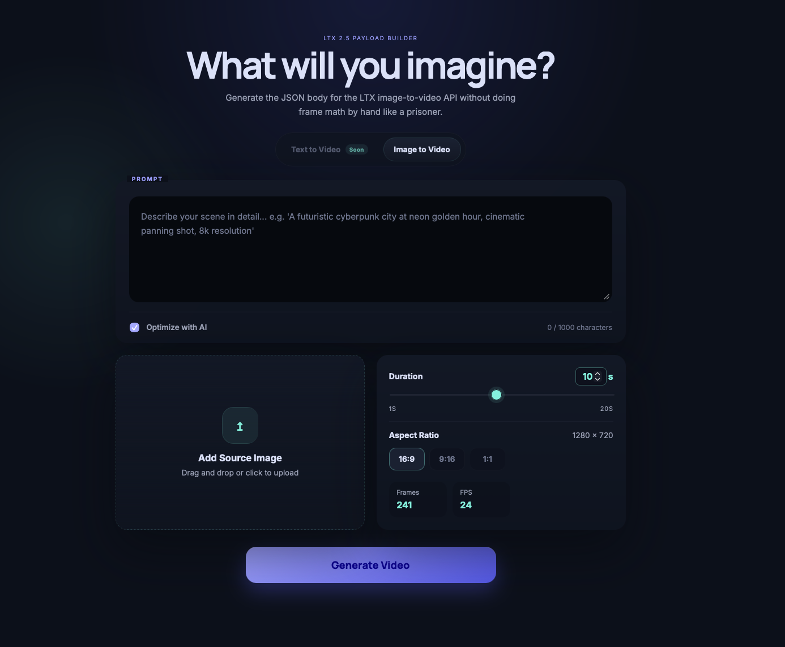

# LTX 2.5 video + latest Comfy UI (RunPod-first serverless/pod image)

[](https://www.buymeacoffee.com/vavo) [](https://github.com/sponsors/vavo) [](https://www.patreon.com/vavo)

Generate LTX 2.5 text-to-video and image-to-video on RunPod without rebuilding the same GPU environment every time. Use it as a serverless worker for API jobs or launch it as an interactive pod with both a simple frontend and the full ComfyUI canvas.

## What you get

- LTX 2.5 distilled INT8 inference tuned for modern NVIDIA GPUs
- A clean web frontend for quick text-to-video and image-to-video generation
- ComfyUI for visual workflow editing and advanced control
- A RunPod serverless handler for `/run` and `/runsync`
- Automatic first-boot model downloads to persistent storage
- Persistent models, ComfyUI state, Python environment, and caches under `/workspace`
- Separate workflows for API execution and the ComfyUI editor, for both text-to-video and image-to-video
- Live startup checks that catch missing or unindexed models before jobs arrive

The recommended image is:

```text
notrius/ltx-2.5-serverless:cu130
```

## Before you deploy

You will need:

- A RunPod GPU with at least **48 GB VRAM** for the default distilled INT8 profile
- At least **100 GB persistent storage** for models and caches
- Acceptance of the model terms on [Lightricks/LTX-2.5](https://huggingface.co/Lightricks/LTX-2.5)
- A Hugging Face access token if the model download requires authenticated access

Set the token as a RunPod secret or environment variable. The image accepts `HF_TOKEN`, `HUGGINGFACE_TOKEN`, or `HUGGINGFACE_ACCESS_TOKEN`.

## Option 1: Run as a serverless worker

Choose this when another application will submit jobs through the RunPod API and you want workers to scale with demand.

### Install the worker

1. Create a RunPod Serverless template.
2. Use `notrius/ltx-2.5-serverless:cu130` as the container image.
3. Attach a network volume so downloaded models survive worker replacement.
4. Add these environment variables:

```env
RUN_MODE=worker
PERSIST_WORKSPACE=true
LTX25_PRELOAD_VARIANT=distilled-int8
LTX25_PRELOAD_PROMPT_ENHANCER=true
HUGGINGFACE_ACCESS_TOKEN=hf_xxx
```

5. Create an endpoint from the template and wait for the first worker to finish downloading the model stack.

The first cold start is the expensive one. Later workers reuse the models and download/compiler caches from the attached volume.

Redis needs no separate service or account. Leave `REDIS_URL` unset: each worker starts its own local Redis for job tracking, result caching, and duplicate-job prevention. External Redis connections are disabled, and Redis state is neither shared across workers nor saved across container replacement. Interactive pod mode does not use Redis. See [Redis and cached results](docs/configuration.md#redis-and-cached-results).

### Run a worker job

There are two accepted input shapes: a flat request (simplest, recommended) and a raw workflow request (advanced, used by the bundled frontend).

#### Flat input (recommended)

Submit a `prompt` and, optionally, an `image`. Image-to-video vs. text-to-video is chosen automatically from whether `image` is present — no separate flag needed:

```json
{
  "input": {
    "prompt": "A lone warrior walking across a vast desert at dusk.",
    "duration": 5,
    "aspect_ratio": "16:9",
    "optimize_prompt": true
  }
}
```

To generate image-to-video, add `image` (a data URL or raw base64 payload):

```json
{
  "input": {
    "prompt": "The subject turns and walks toward the camera.",
    "image": "data:image/png;base64,...",
    "image_name": "source.png",
    "duration": 5,
    "aspect_ratio": "16:9"
  }
}
```

Flat input fields:

| Field | Type | Default | Notes |
| --- | --- | --- | --- |
| `prompt` | string | required | Non-blank. |
| `image` | string | omitted | Data URL or raw base64. Presence selects image-to-video; absence selects text-to-video. An `http(s)` URL is also accepted, but only when `LTX_ALLOW_REMOTE_IMAGE=true`. |
| `image_name` | string | `source-image.png` | Used for the materialized input filename. |
| `duration` | int (seconds) | `5` | 1–20 seconds. |
| `aspect_ratio` | `"16:9"` \| `"9:16"` \| `"1:1"` | `"16:9"` | |
| `optimize_prompt` | bool | `true` | Toggles the built-in prompt enhancer node. |
| `seed` | int | random | Same seed + same inputs produce the same graph. |
| `mode` | `"i2v"` \| `"t2v"` | inferred | Optional assertion only — if given and it disagrees with what `image`'s presence implies, the job fails instead of silently overriding your input. |

#### Raw workflow input (advanced)

Submit one of the checked-in LTX 2.5 API workflows — [image-to-video](./video_ltx2_5_i2v_API.json) or [text-to-video](./video_ltx2_5_t2v_API.json) — through RunPod `/run` or `/runsync`:

```json
{
  "input": {
    "workflow": {},
    "images": [
      {
        "name": "source.png",
        "image": "data:image/png;base64,..."
      }
    ]
  }
}
```

`workflow` must contain a ComfyUI API-format workflow; the empty object above only shows the request structure. Text-to-video jobs carry no source frame, so they omit `images` entirely. If a job includes both `workflow` and a flat `prompt`, `workflow` takes priority and the flat fields are ignored.

#### Response shape

Both input shapes return the same envelope. Results are returned in `output.images[]` and/or `output.videos[]`. S3 output is supported when configured; otherwise artifacts are returned inline.

## Option 2: Run as an interactive pod

Choose this when you want to create videos directly, edit workflows in ComfyUI, or inspect the stack interactively.

### Install the pod

The quickest route is the ready-made RunPod template:

[**Deploy the LTX 2.5 Pod template**](https://console.runpod.io/deploy?template=zzlfhm0e3c&ref=o3idfm0n)

When configuring the pod:

1. Select a GPU with at least 48 GB VRAM.
2. Attach persistent storage at `/workspace`.
3. Confirm these environment variables:

```env
RUN_MODE=pod
PERSIST_WORKSPACE=true
LTX25_PRELOAD_VARIANT=distilled-int8
LTX25_PRELOAD_PROMPT_ENHANCER=true
HUGGINGFACE_ACCESS_TOKEN=hf_xxx
```

### Run the pod

After startup, open either service from RunPod:

- **Frontend — port `7777`:** pick Text to Video or Image to Video from the mode selector, write a prompt (and upload an image for image-to-video), choose the duration, and generate
- **ComfyUI — port `8188`:** edit or run the bundled visual LTX 2.5 workflows

Both editor workflows are installed in the ComfyUI user workflow library. The API workflows remain separate for the frontend and serverless handler. Text-to-video uses the same model stack as image-to-video, so switching modes needs no additional model downloads.

Models download automatically on the first deployment. Startup then verifies that ComfyUI can actually see the transformer, text encoders, VAEs, and latent upscaler—not merely that files exist somewhere on disk looking decorative.

### Bundled Frontend



## Persistent storage

`/workspace` is the home of everything worth keeping:

```text
/workspace/models                    downloaded LTX 2.5 models
/workspace/worker-comfyui/comfyui    ComfyUI and user state
/workspace/worker-comfyui/venv       Python environment
/workspace/worker-comfyui/cache      download and compiler caches
```

The container links `/comfyui/models` directly to `/workspace/models`. Do not bake model weights into the Docker image; persistent storage keeps the image smaller and avoids downloading the same weights for every replacement worker.

## Build your own image

The public CUDA 13 image is recommended for normal use. To publish your own build:

```bash
docker buildx bake ltx2-5-distilled-int8 \
  --set 'ltx2-5-distilled-int8.tags=<registry>/<image>:cu130' \
  --push
```

All release targets build for `linux/amd64`. CUDA 13 is the primary Blackwell-first path; CUDA 12.8 is available as a fallback target.

Code changes take effect only after rebuilding the image and replacing the running containers. If upgrading from external Redis, follow the [Redis migration steps](docs/deployment.md#upgrading-from-external-redis).

| Target | Purpose |
| --- | --- |
| `ltx2-5-distilled-int8` | Recommended CUDA 13 image with automatic model preload |
| `ltx2-5-distilled-int8-cu128` | CUDA 12.8 fallback with automatic model preload |
| `base` | CUDA 13 base without model preload |
| `base-cuda12-8-1` | CUDA 12.8 base without model preload |

## Runtime modes

| Mode | What starts |
| --- | --- |
| `worker` | ComfyUI, frontend, and RunPod serverless handler |
| `pod` | ComfyUI and frontend, without the serverless handler |
| `local-api` | ComfyUI, frontend, and a local RunPod-compatible API on port `8000` |

## Under the hood

- Ubuntu 24.04
- PyTorch 2.11 with its packaged CUDA 13 runtime
- ComfyUI with Manager, Downloader, and the official LTXVideo nodes
- Distilled INT8 ConvRot transformer and text encoder
- Official LTX 2.5 video/audio VAEs and latent upscaler
- Persistent Hugging Face, pip, Torch, and Triton caches

Model weights are downloaded during the first deployment and are not part of the Docker image.

## Production validation

The repository tests workflow transformation, request handling, bootstrap behavior, model discovery, shell/Python syntax, and Docker build definitions. Before treating a custom build as production-ready, boot it on the intended GPU class and complete a real generation using the checked-in workflow.

## Documentation

- [Deployment](docs/deployment.md)
- [Configuration](docs/configuration.md)
- [Network volumes and model paths](docs/network-volumes.md)
- [Customization](docs/customization.md)
- [Development](docs/development.md)
- [CI/CD](docs/ci-cd.md)

## Support the project

If this image saves you from another evening of CUDA archaeology, you can support continued maintenance here:

[](https://github.com/sponsors/vavo) [](https://www.buymeacoffee.com/vavo) [](https://www.patreon.com/vavo)

## License

MIT — build something useful, and preferably something less temperamental than the average CUDA environment.
